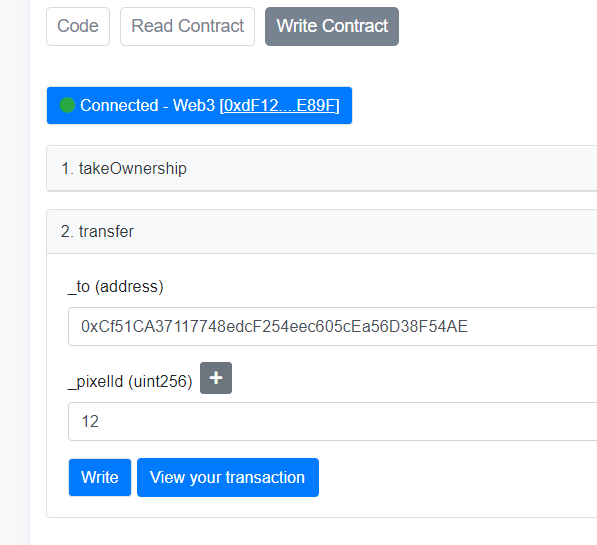
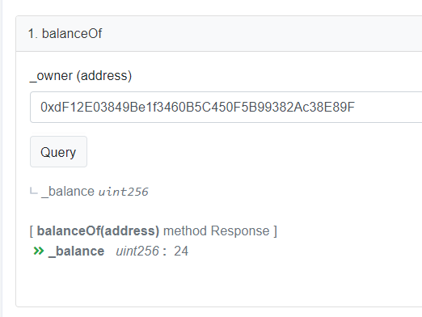
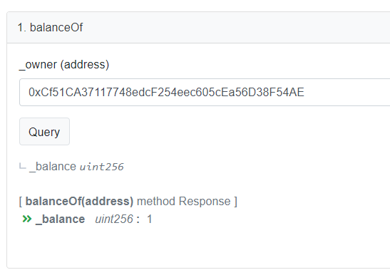
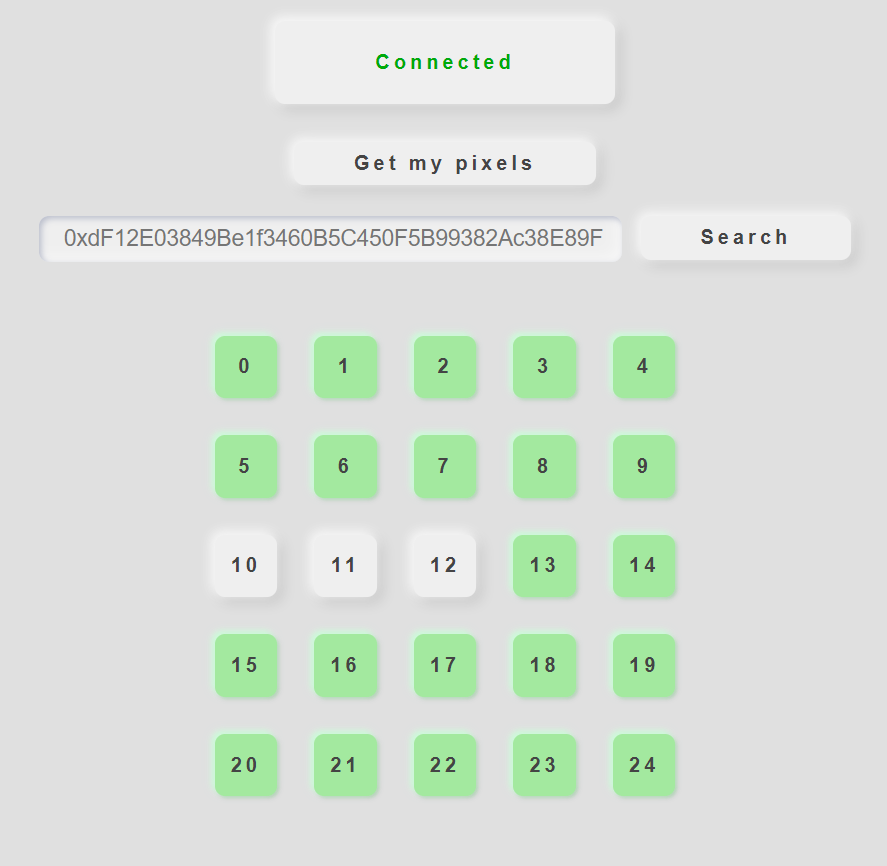

# Cours blockchain

## Prérequis :
 - Extensions :
   - Metamask
   - Phantom

### Intro
Le besoin : Le but est de s'assurer que le message arrive au destinataire, et vérifier l'authenticité du message.

Qu'est-ce que le peer to peer ? C'est un système de communication entre personnes sans passer par un serveur centralisé.

Dans un systeme blockchain les noeuds fonctionnent ensemble pour éviter la falsification. Iy a un consensus qui permet de s'assurer que les noeuds sont en accord.

Quelques dates et noms :

1991
Stuart Habe
Scott Stornetta

1992
Merkle tree

2005
Bitgold

Double spend

Les limites du bitcoint étaient qu'il n'y avait pas moyen de dvéleopper des applications.
Il a donc créer la blockchain etherum pour développer des applications -> dApps

### La chain

Le principe :
Chainage de blocs contenant
 - Des pointeurs (précédent, suivant) (liste chaînée restrictive)
 - Des transactions ( Il peut y avoir plusieurs transactions dans un bloc)

Composants Block Chain:
- Noeuds légers ou complets: infrastructure
   - Réseau d'ordinateurs, de serveurs donc interconnectés
   - Contiennent une copie de la BC si noeud complet
   - Se synchronisent (ordinateur éteint) entre eux (MAJ BC)
- Les mineurs : acteurs + infrastructure
   - Qui mettent a disposition uen puissance de calcul (noeud) 
   - Sont motivés financièrement (recompense)
   - Sont contrôlés (proof of stake, proof of work)
   - Outre leur fonction de noeuds, ils créent des blocs
   - Tous les noeuds ne sont pas "mineurs"   

Les smartcontract s'executent dans l'EVM (Ethereum Virtual Machine)

Il y a 2 types de clés
   - Privée : permet de se connecter a son compte
   - Publique : permet de recevoir des fonds / stock les crypto

Les frais de gas sont estimés par metamask mais on peux les changer manuellement.
Si trop peu, la transaction sera refusée ``A tester : faire un gros contrat et un petit et comparer les frais de GAS necessaires``
Si trop le surplus sera remboursé ``A tester : Par qui c'est remboursé ?``

Consigne : 
1. Déployez un smart contract qui créé un token de type ERC20 en solidity
2. Décrivez comment on peut gérer les nombres a virgules flottantes avec Solidity
3. Pourquoi parle-t-on de nombre de décimales au sein du contrat ERC20.sol ?

J'ai réussi a écrire le transfert d'un pixel (ici le pixel 12 (X:2 , Y:2):

L'adresse possédant tout les pixels a donné transféré 1 a un autre adresse

Balance de la 2eme adresse :

Contrat : ``0x469247301473aB9936Aca13bDA50a806344787E0``

Pour tester l'application react : 

Adresse qui possède 10-11-12 : ``0xCf51CA37117748edcF254eec605cEa56D38F54AE`` 
Adresse qui possède les autres (la mienne) : ``0xdF12E03849Be1f3460B5C450F5B99382Ac38E89F``

